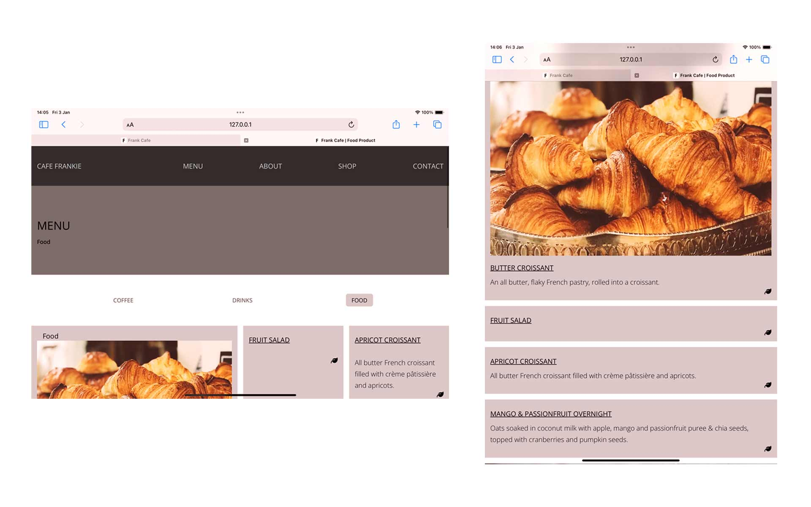
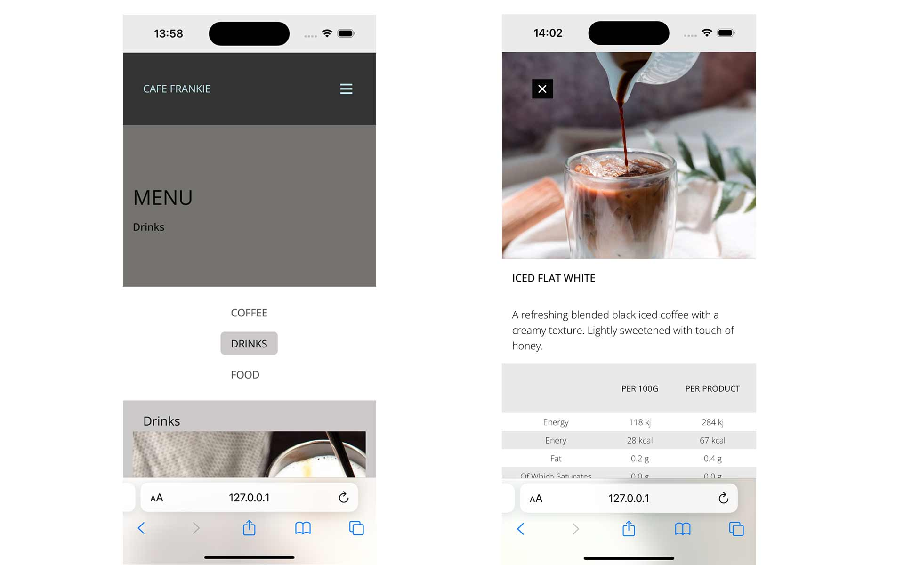
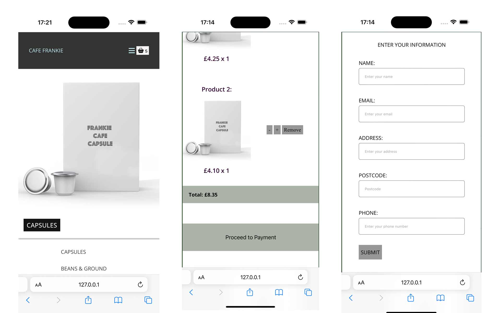
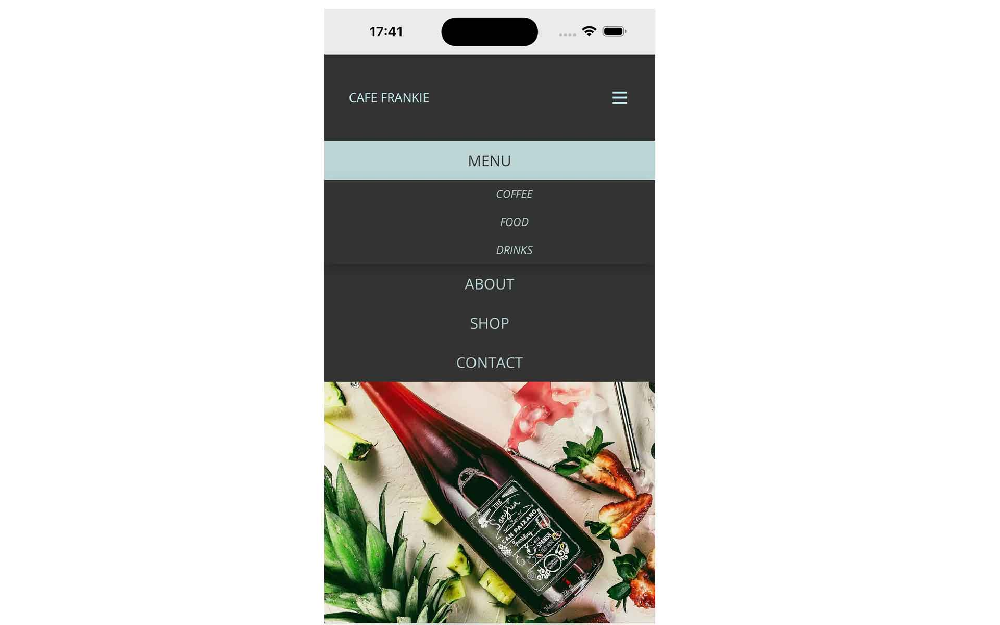
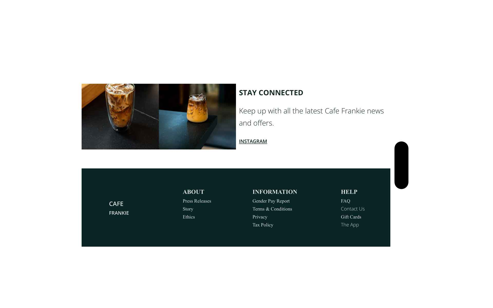

# FRANKIE CAFE

# Introduction
Welcome to FRANKIE cafe: 
The primary goal of Frankie Cafe is to create a vibrant, user-friendly platform, Responsive where user can run through the website, View products and it information. Shop navigation is added to website where users can also views products with it prices, 
add to the basket for users and buy. Another goal for users who love cafe, drinks and food can able to shop online and visit nearby shop.

# Target Audience
Frankie Cafe is designed for a diverse audience, Young Professionals, Students, Families, Tourists or Passersby, Retirees or Older Adults, Remote Workers & Freelancers.

## ux
The goal is to create a seamless, engaging experience that reflects the Frankie Cafe’s brand and helps customers easily navigate through the website. Here’s a breakdown of key UX elements for Frankie cafe website:
### section:
- Visually Appealing: I use high-quality images Frankie coffee cafe and cozy interior.
- Brand Identity:  Use colors, fonts, and imagery consistent with Frankie cafe branding.

### Navigation Bar:
- Navigation Links: I use navigation button for my Menu, Home, Menu, Locations, About, Contact and  Order Online,
### Social Proof:
- App Links: I have designed app link that would be link the google pay store and apple store for users to download them.
- Instagram: instagram link is also desinged which would later be link to frankie cafe profile.

### Menu Page

I have designed dropdown list of buttons include coffee, drinks and food products that users can view them in modal
- Images: Show appealing photos of the food and drinks to entice visitors.
- Descriptions: Provide short descriptions of each item, highlighting key ingredients or unique features.
- Guide: Provided nutrition and allergy guide which users can able to read throug for allergy guidance.
- Extras: Provided extras iterms where users have the choice option of drinks, cafe and food. eg raspberry and marshmallows
### Locations Page
- Frankie cafe has just one location
- Provided map that will help you to find the closest shop nearby and users current location using Google Api.
- Telephone number.

### Lazy loader
- Provided lazy loading that enhances the users experience on all the pages.
###  Online Ordering 
- Shop: Provided online order button where categories with 5 products, eg coffee capsules, coffee beans, Gift Ideas, Gift card and Clearance ( discounted prices ).
- User Information: Provided users form for validation with the total amount of products added in the basket but yet to add the payment method.

- colors: #370501, #131301, #363630, #969696, #74726f,

### Functional Requirements:
- Primary Navigation: users able to naviagte through menu with 3 categrories where each categories have grid of products images and information. each information click comes up with a modal with products information, eg image, kcal, grams, kg.

###  About Us / Brand Story Page
- Provided information to users who want to know more about Frankie cafe and why they should care about Frankie Cafe products. Provided information about the origin of Frankie Cafe, Taste of our coffee and the award wining of our classico blend. Provided history behind Frankie cafe and how the brand started.
###  Mobile Optimization
- Fast Loading: Ensure images are optimized for mobile, and the site loads quickly. using srcset in html, photoshop and sqooush app to reduce the file size and format into webp.
- Touch-Friendly: Make buttons and links large enough for easy tapping.
- Mobile Menu: Have a collapsible, easy-to-use mobile menu for quick access.

### Tools & Technologies Used
- speedpageInsight
- Javascript
- HTML
- CSS & SCSS
- Font Awesome
- w3school.com
- Markdown
- XMLHttpRequest
- W3C Markup Validation Service
- Github
- Git
- localstorage
- Photoshop
- colorsafe.co
- webaim.org

### Testing
-  W3C Validator 

### footer
- Links: Home, Menu, Locations, Social Media, Contact, Terms & Conditions, Privacy Policy, Press Releases.
- Location Information: Address, phone number, and a link to the full Locations page.
- 

